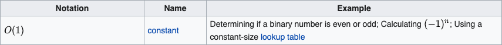
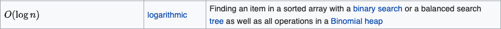
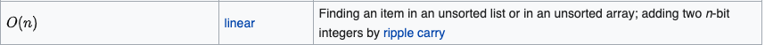
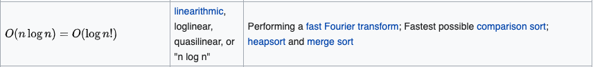
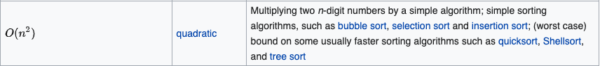
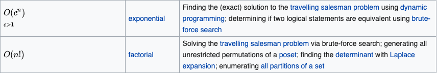

# Big O Notation

Big O is a mathematical notation used to classify algorithms according to how their run time or space requirements grow as the input size grows. 

Big O notation characterizes functions according to their growth rates: different functions with the same growth rate may be represented using the same O notation.

The leter O is used because the growth rate of a function is also referred to as the **order of the function**.

