# TCP/IP

**TCP/IP**, which stands for **Transmission Control Protocol/Internet Protocol** is a group of guidelines according to which network devices are connected via the internet. This protocol determines the means by which data is transferred over the internet.

## What do TCP and IP do?

**TCP** provides **reliable, ordered and error-checked** delivery of a stream of bytes between applications running on hosts communicating via an IP network.

TCP handles all handshaking and transmission details and presents an abstraction of the network connection to the applications running on the hosts.

Because of factors such as network congestion, traffic load balancing or unpredicatable network behaviour, packets may be lost, duplicated or delivered out of order. TCP detects these problems, requests re-transmission of lost data, re-arranges out-of-order data or deletes duplicate data. Once the TCP receiver has reassembled the sequence of bytes originally transmitted, it passes them to the receiving application. (So this networking details are abstracted by the TCP from the application communication).

TCP is a reliable stream delivery service which guarantees that all bytes recieved will be identical and in the same order as those sent. Since packet transfer by many networks is not reliable, TCp achieves this using a technique known as *positive acknowledgement with re-transmission*. This requires the receiver to respond with an acknowledgement message as it receives the data. The sender keeps a **record** of each packet it sends and mantains a **timer** from the moment when the package was sent. The sender re-transmits a packet if the timer expires before receiving the acknowledgement, which could mean that the packet got lost or corrupted.

Major internet applications such as the World Wide Web (WWW), email (SMTP), P2P file sharing, Secure Shell (SSH) and file transfer (FTP) rely on TCP, which is part of the Transport Layer of the TCP/IP suite.

**IP (Internet Protocol)** has the task of delivering packets from the source host to the destination host solely based on the IP addresses in the packet headers. For this purpose, IP defines packet structures that encapsulate the data to be delivered, which contain a header and a payload. IP determines the route that the packet takes to reach its destination: it sets the route for the packet transfer.

## How do TCP and IP layers work together?

While **IP** handles actual delivery of the data, **TCP** keeps tracks of segments - the individual units of data that a message is divided into for efficient routing thought the network. 

For example, when an HTML file is sent from a web server, the TCP layer divides the file into segments and forwards them individually to the **internet layer** on the **network stack**, where the **IP** protocol encapsulates each of them into an IP packet by adding a header which contains (among other data) the destination IP address, while the payload is the actual data to be transmitted.

When the client program on the destination host receives them, the TCP software in the transport layer re-assembles the segments and ensures they are correctly order and error-free. Then it streams the file contents to the receiving application. 

## Network Stack Layers

The Request For Comments (RFC) 1122 loosely defined a four-layer model, with the layer having names:


There are four layers that comprise **Network Stack**:

1. The **Application Layer** is the scope in which applications, or processes, create user data and communicate this data to other applications on another or the same host. The applications make use of the services provided by the underlying lower layer, especially the (next) transport layer, which provides with either reliable or unreliable pipes to other processes. This is the layer in which all application protocols, such as **HTTP, SMTP, FTP and SSH** operate. Processes are addressed via ports which essentially represent services.
2. The **Transport Layer** performs host-to-host communications on either the local network or remote networks separated by routers. It provides a channel for the communication needs of applications. Here, connectivity can be categorized as either **connection-oriented, implemented in TCP**, or as **connectionless, implemented in UDP**. This layer is for example where TCP addresses reliability issues during the transfer like packets arriving in the wrong order, or corrputed, or being list.
3. The **Internet Layer** provides internetworking between independent networks, by hiding the actual topology of the underlying network connections. It is therefore the layer that defines and establishes the Internet. This layer defines the addressing and routing structures used in the **IP protocol**, which defines IP addresses. Its function is to transport packets to the next host, functioning as an IP router, that has the connectivity to a network closer to the final destination of the data.
4. The **Link Layer** contains the communication methods for data that remains within a single network segment. It includes the protocols used to describe the local network topology.

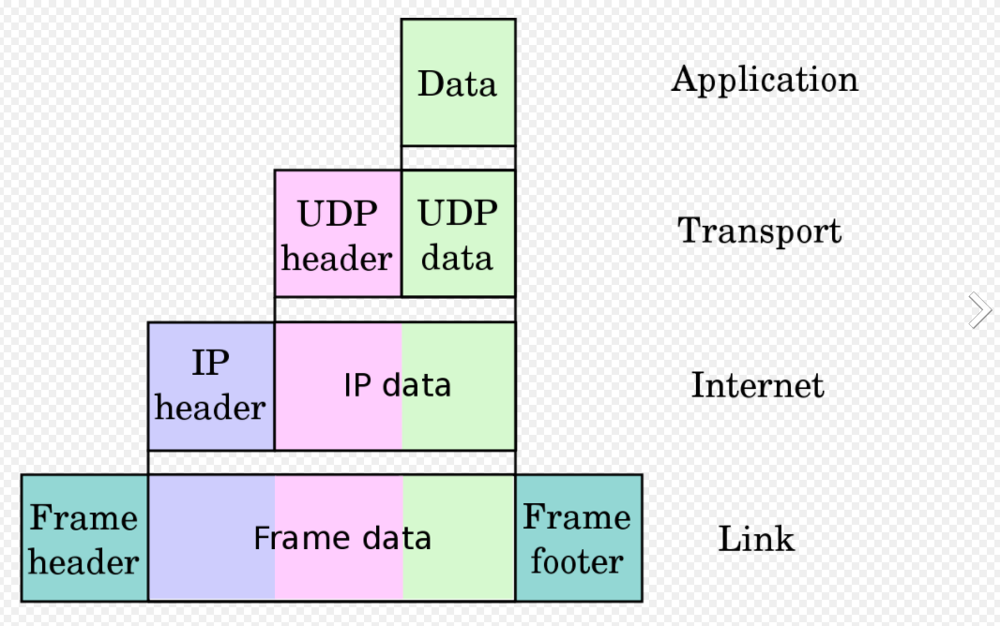
Example of encapsulation of application data carried by UDP to a link protocol frame.

## TCP Protocol Operation

**TCP protocol operation** is divided into thre phases: connections must be properly established in a multi-step handshake process during the ***connection establishment*** phase, before entering the actual ***data transfer*** phase.

After data transfer is completed, the ***connection termination*** closes established virtual circuits and releases all allocated resources.


### *Connection establishment: TCP and the Three-Way Handshake*

**TCP** sets up connections via a three-way handshake, which is also called **SYN-SYN-ACK**. It is named so because three messages are required to start the connection between two network devices. 

Before a client attempts to connect with a server, the server must first bind to and listen at a port to open it up for connections: this is called a **passive open**. 

Once the the passive open is established, a client may initiate an **active open**.

To establish a connection, the three-way handshake occurs:

1. **SYN:** The first host, or client, performs an active open by sending a **SYN** packet to the server. The client sets the segement's sequence number to a random value X.
2. **SYN-ACK:** In response, the server replies with **SYN-ACK**, with the acknowledgement number and an additional sequence number. The acknowledgement number is set to one more than the recieved number, i.e. X+1, while the server's sequence number is set to a random number Y.
3. **ACK:** Finally, the clients sends an **ACK** back to the server. The sequence number is set to the received acknowledgement number (X+1) from the server and the acknowledgement number is set to recieved sequence number from the server, plus 1, i.e.: Y+1.

At this point, both the client and server have received an acknowledgement of the connection. The steps 1 and 2 establish the connection parameter (or sequence number) in onde direction and it is acknowledged. The steps 2 and 3 establish the connection parameter for the other direction and it is acknowledged. With these, a full-duplex communication is established.


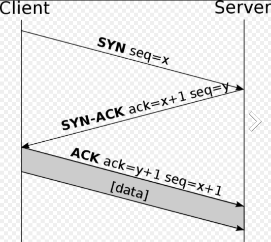

### *Connection termination*

The connection termination phase uses a four-way handshake, with each side of the connection terminating independently.

When an endpoint wishes to stop its half of the connection, it transmits a **FIN** packet, which the other end acks with an **ACK** packet.

Therefore a typical connection termination requires a pair of **FIN** and **ACK** segments from each TCP endpoint, i.e. four packets delivered:

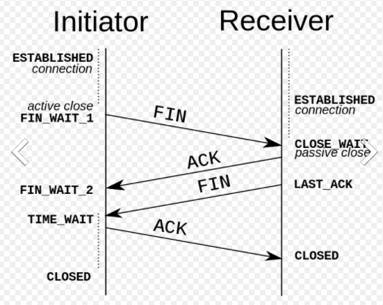

After the side that sent the first **FIN** has responded with the final **ACK**, it waits for a timeout before finally closing the connection, during which time the local port is unavailable for new connections: this prevents confusion due to delayed packets being delivered in subsequent connections.


## IP Protocol: IPv4 vs IPv6

An IP address is a string of numbers that is assigned to a device to identify it on the internet. It is an address, just as the number and street of a home address, where packets can be sent to. That is exactly what the IP does: send packets to IP addresses.

There are two versions of Internet Protocol addresses: IPv4 and the newer IPv6.

### IPv4

Internet Protocol version 4 was developed in the early 1980s.

An **IPv4** comprises four number, each ranging from 0 to 256, separated by periods, a 32-bit address. Because of this, IPv4 has a theoretical limit of 4.3 billion addresses, which was more than enough. But with today's era of smartphones and IoT devices, we have went close to running out of addresses.

While initially workarounds have been implemented to postpone the issue, a successor was quickly needed and IPv6 was developed. At present, IPv4 and IPv6 coexist on the internet, but eventually as IPv4 equipment gets phased out, everything will be IPv6. It is just being rolled out slowly as replacing old IPv4 equipment would be prohibitively expensive and disruptive.

### IPv6

Internet Protocol version 6, or **IPv6** was introduced in the late 1990s as a replacement for IPv4.

**IPv6** uses 128-bit addresses, allowing for a theoretical 340 undecillion addresses. They are represented by eight groups of four hexadecimal digits, with the group separated by colons, although they are often abreviated.

In addition of solving the supply IP addresses, IPv6 also addressed many of version 4 shortcomings.

### IPv4 vs IPv6

IPv6 brought more functionality, in addition to more IP addresses.

* **More Efficient Routing:** IPv6 reduces the size of routing tables and makes routing more efficient and hierarchical. It allows ISPs to aggregate the prefixes of their customer's networks into a single prefix and announce this one prefix to the IPv6 internet.
* **More Efficient Packet Processing**: IPv6's simpliefied packet header makes packet processing more efficient. Compated to IPv4, IPv6 contains no IP-level checksum, so the checksum does not need to be recalculated at every router hop. Getting rid of the IP-level checksum was possible because most Link Layer technologies already contain checksum and error-control capabilities. In addition, most Transport Layers, which handle end-to-end connectivity, have a checksum that enables error detection.
* **Directed Data Flows:** IPv6 supports **multicast addressing**, rather than broadcast. This allows bandwith-intensive packet flows (such as multimedia streams) to be sent to multiple destinations simultaneously, saving network bandwidth. Desinterested hosts no longer must process broadcast packets.
* **Simplified Network Configuration**: IPv6 has a new feature called **autoconfiguration**, which allows a device to generate an IPv6 address as soon as it powers up and puts itself on the network. Adress auto-configuration (addess asignment) is built into IPv6. A router will send the prefix of the local link in its router advertisements. A host can generate its own IP address by appending its Link-Layer (MAC) address converted into Extended Universal Identifier (EUI) 64-bit format, to the 64 bits of the local link prefix.
* **Support For New Services:** By eliminating Network Address Translation (NAT), true end-to-end connectivity at the IP layer is restored, enabling new and valuable service. Peer-to-peer networks are easier to create and maintain, and services such as VoIP and Quality of Service (QoS) become more robust.
* **Security:** IPSec, which provides confidentiality, authentication and data integrity, is baked into IPv6.

# User Datagram Protocol (UDP)

**UDP** is a simple message-oriented Transport Layer protocol, documented in RFC 768. It uses a simple connectionless communication model with a minimum of protocol mechanisms: it has no handshaking dialogues and thus exposes the user's program to any unreliability of the underlying network; there is no guarantee of delivery, ordering or duplicate protection.

While it provides **integrity verification via checksum** of the header and payload, it provides no guarantees of message delivery to the Application Layer. 

Also, UDP retains no state of UDP messages once sent (in comparison with TCP). For this reasons, sometimes UDP is referred as Unreliable Datagram Protocol: if transmission reliability is desired when using UDP, it must be implemented on the Application layer, on the actual application.

Being connectionless, **UDP can broadcast** - sent packets can be addressed to be receivable by all devices on the subnet.

UDP is suitable for purposes where error checking and correction are either not necessary or performed in the application. Time-sensitive application often use UDP because dropping packets is perferable to waiting for packets delayed due to retransmission (such as in TCP), which may not be an option in a real-time system.

Streaming media, real-time multiplayer games and voice over IP (VoIP) are examples of applications that often use UDP. In these particular apps, loss of packets is not usually a fatal problems: in VoIP, for example, latency and jitter are the primary concerns. Using TCP for VoIP woould cause delays if any packets were lost as TCP does not provide subsequent data to the application white it is requesting the re-send of the lost data.

## Why does DNS use UDP and not TCP?

DNS is an Application Layer protocol.  TCP is reliable and UDP is not reliable. DNS is supposed to be reliable, but it still uses UDP: why?
 
There are interesting reasons concerning TCP and UDP on the Transport Layer that justify this choice:

1. UDP is much faster. TCP is slow as it requires 3-way handshake. The load on DNS servers is also an important factor. DNS servers (since they use UDP) don’t have to keep connections.
2. DNS requests are generally very small and fit well within UDP segments.
3. UDP is not reliable, but reliability can added on Application Layer. An application can use UDP and can be reliable by using a timeout and resend at the Application Layer.

Actually, DNS primarily uses the User Datagram Protocol (UDP) on port number 53 to serve requests. DNS queries consist of a single UDP request from the client followed by a single UDP reply from the server. When the length of the answer exceeds 512 bytes and both client and server support EDNS, larger UDP packets are used. Otherwise, the query is sent again using the Transmission Control Protocol (TCP). TCP is also used for tasks such as zone transfers. Some resolver implementations directly use TCP for all queries.


# Domain Name System (DNS)

**Domain Name System (DNS)** is a decentralized naming system for resources connected to the Internet or a private network, that associates various information with domain names. More prominently, it translates "easy to remember" domain name to the numerical IP addresses needed for locating and identifying computer services and devices across the Internet.

The most common types of records stored in the DNS database are:
* **IP addresses (A -IPv4- and AAAA -IPv6-)**
* Domain name aliases **(CNAME)**: A **Canonical Name Record** is a type of resource that maps one domain name (an alias) to another (the canonical name). This can prove convenient when running multiple services (such as an FTP server and a web server, each running on different ports) from a single IP address. One can, for example, point *ftp.example.com* and *www.example.com* to the DNS entry for *example.com*, which in turn has an *A record* which point to the IP address. Then if that IP address ever changes, one only has to change the A record. **CNAME** record must always point to another domain name, never directly to an IP address.
* **Start of Authority (SOA) record**: contains administrative information about the zone, especially regarding zone transfers. Normally DNS name servers are set up in clusters. The database within each cluster is synchronized through zone transfers. The SOA record for a zone contains data to control the zone transfer. This is the serial number and different timespans. It also contains the email address of the responsible person for this zone, as well as the name of the primary master name server.
* **SMTP mail exchangers (MX)**: Maps a domain name to a list of *Message Transfer Agents* for that domain. **MTAs** is software that transfers email messages from one comouter to another using **SMTP**.
* Pointers for **reverse DNS lookups (rDNS)**: it is the querying technique of the DNS to determine the domain name associated with an IP address - the reverse of the usual "forward" lookup of an IP address from a domain name.

### Server Hierarchy

DNS records are part of a distributed database. This means all records are not stored at any one server but they are distributed among several global servers.

DBS servers are divided into zones that form a **hierarchy**.

The servers are the top are called **root servers** and they store IP addresses of other DNS servers, called **top level domain servers (TLD)**.

**TLDs** are divided by site-type, i.e. `.com` or `.edu` and they have mappings to **second-level domain servers**, such as a server for `wikipedia.com`. These are the DNS servers that contain mappings to the actual server that host the domain in question.

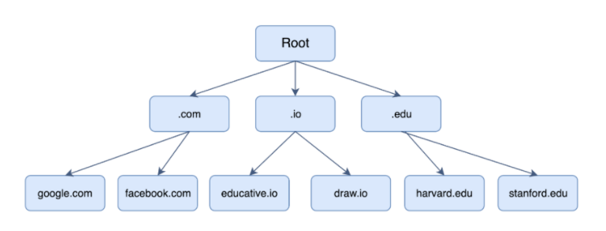

When a client such as a **browser** is introduced an URL, the lookup goes through a number of steps:

1. The first thing a **browser** does is check with its own **browser cache**, which maintains its DNS records as a cache for a specified amount of time, for sites that have been previously visited. If its there, the IP address is returned.
2. If not, the browser requests the underlying **Operating System (OS)**, to check if the hostname is resolved in the local `hosts` files, whose location varies according to the OS.
3. If is not found there, the browser checks if the domain is found in the **Router Cache**, as they also keep a cache of DNS records.
4. If not found, a further check is done in the **Internet Service Provider (ISP) Cache**, which also keeps DNS records on its cache.

If no results are found in any of the temporary stores, a **full recursive DNS resolution** procedure is started: the **ISP's DNS server** initiates a DNS query to find the IP address of the domain we are looking for.

It is called a **recursive search** because the search will repeatedly continue from a DNS server to DNS server until it either finds the IP address or returns an error saying the domain was not found.

1. The first point of contact between the **DNS resolver** for a full resolution is a **root server**. There are now over a thousand root servers (thanks to anycast), although originally there were only 13.
2. The **root server** returns the **IP address** of the relevant **top-level domain server** (.com, .edu, .org, etc.).
3. The **top-level domain (TLD) server** return the IP address of the second level domain server (wikipedia.com, bds.edu). **TLD servers** tell the resolver to ask the information to **Authoritative Name servers**.
4. The **Authoritative Name servers** or **second-level domain server** contains the **DNS record** of the server we are looking for. The **second-level domain server** returns the IP address to the resolver, which caches it in case the same requests comes again. The resolver then returns the address to the **browser** so it can make the request.

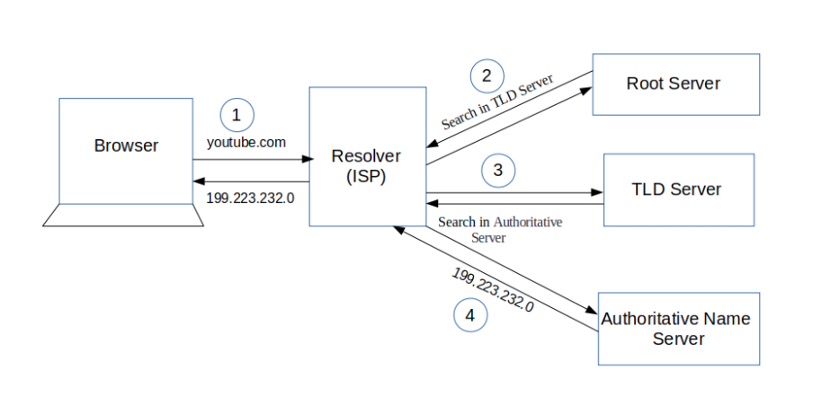

A good way to think of this is that a domain name is resolved in reverse:

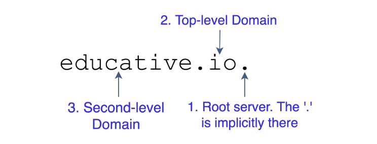

Though not usually visible, there is a dot after the URL, which represents the root server. The root server return the address of a top-level domain server, in this case for an `io` server.

The `ui` server then returns the addres to the `educative` DNS server.

Finally, the `educative` DNS server returns the IP address to the educative website.

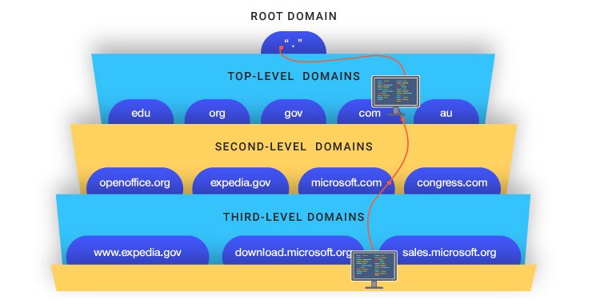

# HTTP (HyperText Transfer Protocol)

**HTTP (HyperText Transfer Protocol)** is an **Application Layer protocol** for transmitting resources, such as HTML documents. It was designed for communication between web browsers and web server, but it can also be used for other purposes.

HTTP follows a classical **client-server model or protocol**, which means a client opens a connection to make a request, then wait until it receives a response. HTTP is a **stateless protocol**, meaning that the server does not keep any state information between two requests, although it is not **sessionless**.

While **HTTP** is run mostly on **TCP**, it can be used with any reliable Transport Protocol which doesn't silently lose packets (such as UDP).

HTTP is the foundation of data communication for the World Wide Web, where hypertext documents include huyperlinks to other resources that the user can esaily access.

**HTTP/1.1** was first documented at the end of the 90s. **HTTP/2** is a major revision of the protocol that was released in 2015, and left untouched all of the original semantics such as methods, status codes, header fields and URIs. Whit is new is how the data is framed and transported between the client and server.

HTTP/2 allows the server **to push content**, that is, to respond with data for more queries than the client requested. This allows the server to supply data it knows a web browser will need to render a web page, without waiting for the browser to examine the first response, and without the overhead of an additional request cycle.

Additional performance improvments of HTTP/2 come from **multiplexing** of requests and responses on the same TCP connection. However, because it still runs on a single connection, there is still potential for **head-of-line blocking** to occur if TCP packets are lost or delayed in transmission.

## Encryption

HTTP/2 is defined for both HTTP and HTTPS URIs, but although the standard does not require usage of encryption, all major implementations of browsers (Firefox, Chrome, Safari, Opera, Edge) jave stated that they will only support HTTP/2 over TLS, which makes encryption de facto mandatory.

## TLS and SSL

**Transport Layer Security (TLS)** and its now deprecated predecessor **Secure Sockets Layer (SSL)** are cryptographic protocols designed to provide communications security over a computer network. Several versions of the protocols find widespread use in applications such as web browsing, email, instant messaging and voice over IP. Websites can use TLS to secure all communications between their servers and web browsers.

The TLS protocols **aims to provide privact and data integrity** between two or more communicating computer apllications. When secured by TLS, connections between a client and a server should have one or more of the following properties:

* The connections is **private (or secure)** because symmetric cryptography is used to encrypt the data transmitted. The keys for this encryption are generated uniquely for each connection and are based on a shared secret that was negotated at the start of the session, in a **TLS handshake**, before the first byte of data is trasmitted.
* The identity of the communicating parties can be **authenticated** using public-key cryptography.
* The connection is **reliable** because each message transmitted includes a message integrity check using a **message authentication code** to prevent undetected loss or alteration of data during the transmission.

Since applications can communicate either with or without **TLS**, it is necessary for the client to indicate to the server the setup of a TLS connection. One of the main ways of achieving this is to **use a different port number for TLS connections**, for example, port 443 for HTTPS.

Once the client and server have agreed to use TLS, they negotiate a stateful connection by using a handshaking procedure. Once the handshake is done, the secured connection begins, which is encrypted and decrypted with a session key until the connection closes.

TLS and SSL **do not fit neatly** into any single layer of the network stack or the TCP/IP model. TLS runs **on top of a reliable Transport Layer protocol (e.g. TCP)**, which would imply that it is above it.

## HTTP/3

**HTTP/3** is the proposed successor to HTTP/2. It will use UDP instead of TCP for the underlying transport protocol.

## Components of HTTP-based systems

HTTP is a client-server protocol: clients and server communicate by exchanging individual messages (as opposed to a stream of data). The messages sent by the client, usually a Web browser, are called *requests* and the messages sent by the server as an answer are called *responses*.

*Requests* are sent by one entity, the *user-agent* (or a proxy on its behalf). Each individual request is sent to a server, which handles it and provides an answer, called the *response*.

Between the client and the server there are numerous entities, collectively called **proxies**, which perform different operations and act as gateways or caches, for example.

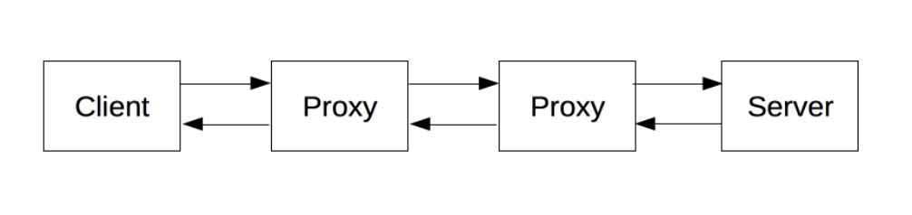

### Client: the user-agent

The **user-agent** is any tool that acts on behalf of the user. This role is primarily performed by web browsers, but tools like Postman, also.

The user-agent is **always** the entity initiating the request, although some new technologies and mechanism allow for server-initiated messages.

To present a Web page, the browser sends an original request to fetch the HTML document that represents the page. It then parses this file, making additional requests corresponding to execution scripts, CSS and subresources such as images and videos. The broswer then mixes these resources to present to the user a complete document, the Web page. Scripts executed by the browser can fetch more resources in later phases and the browser updates the Web page accordingly.

A Web page is a **hypertext document**, which means some parts of it are link which can be activated to fetch a new web page and navigate through the Web.

### Server: the Web server

On the opposite side of the communciation channel is the server, which *serves* the document as requested by the client. It appears as a single machine virtually: this is because it may actually be a collection of server, sharing the load through load balancing, or a complex piece of software interrogating other services (like a cache, a database, etc), generating the requested document on demand.

### Proxies

Between the client and the serves, numerous computers and machines relay the HTTP messages. Due to the layered nature of the **network stack**, most of these operate on the Transport, Internet or Link layers, but those operating on the Application layer are called **proxies**.

**Proxies** can be **transparent** (forward requests they receive without altering in any way), or **non-transparent** (they change the request in some way before passing it forward).

Proxies can perform a number of functions:
* **caching:** the cache can be public or private, like the browser cache
* **filtering:** like an antivirus, firewall or parental control
* **load balancing:** allowing multiple servers to serve a request to a specific resource
* **authentication:** to control access to different resources
* **logging:** allow storage of historical information

## Basic aspects of HTTP

### Simple

HTTP is designed to be **simple and human readable**, even with the added complexity introduced by HTTP/2 by encapsulating the HTTP messages into frames. HTTP messages can be read and understood by humands, providing easier testing and less complexity.

### Extensible

**HTTP headers** make the **protocol easy to extend and experiment with.** New functionality can be introduced with a simple agreement between client and server about a new header's semantics.

### Stateless, but not sessionless

**HTTP is stateless:** there is no link between two requests being successively carried out on the same connection.
While this could mean a problem for users attempting to interacti with certain pages coherently (like an e-commerce basket), **HTTP cookies**, are added to the workflow (thanks to header extensibility), which allow session creation on each HTTP request, maintaining a context.

### Connections

Connections are controlled at the Transport Layer, so they are out of scope for HTTP. However, it relies on the connection being reliable (not losing packets on the way), therefore HTTP relies on TCP, which is connection-based, and not on UDP.

The default behaviour of HTTP/1.0 was to open a separate TCP connection for each HTTP request/response pair. This is less efficient than sharing a single TCP connection when multiple requests are sin in close succession.

So HTTP/1.1 introduce *pipelining* and *persistent connections*. HTTP/2 went a step further by **multiplexing** messages over a single connection. In HTTP/3 the entire Transport Protocol is expected to be switched to QUIC, which builds on UDP.

## Relaxing the origin constraint (CORS)

**Cross-Origin Resource Sharing (CORS)** is a mechanism that uses additional HTTP headers to tell browsers running at one origin to give a web application access to selected resources from a different origin.

A web application executes a cross-origin HTTP request when it requests a resource that has a different origin (domain, protocol or port) than its own.

An example: the frontend JS code served from `https://domain-a.com` uses `fetch`  to make a request for `https://domain-b.com/data.json`.

For security reasons, browsers normally restrict cross-origin HTTP requests initiated from scripts. For example, `XMLHttpRequest` and `fetch` follow the **same-origin policy**: a web app using those APIs can only request resources from the same origin tha appliacation was loaded from, **unless the response from the other origin includes the right CORS headers.**

### Simple requests

**Simple requests** are requests that **don't trigger a CORS preflight**.

For example, suppose web content at `https://foo.example` wishes to invoke content on domain `https://bar.other`. This performs a simpel exchange between the client and the server, using CORS headers to handle the priviliges:

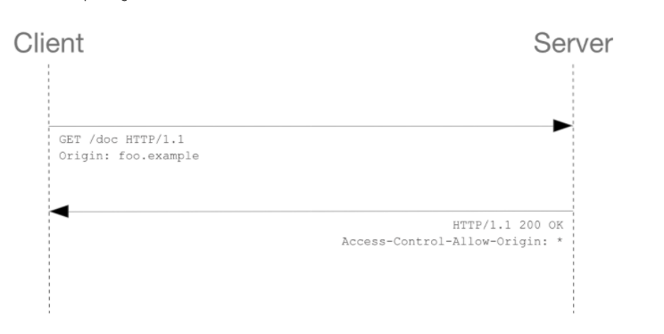

Let's take a look at the browser request and the server response:

```
GET /resources/public-data/ HTTP/1.1
Host: bar.other
User-Agent: Mozilla/5.0 (Macintosh; Intel Mac OS X 10.14; rv:71.0) Gecko/20100101 Firefox/71.0
Accept: text/html,application/xhtml+xml,application/xml;q=0.9,*/*;q=0.8
Accept-Language: en-us,en;q=0.5
Accept-Encoding: gzip,deflate
Connection: keep-alive
Origin: https://foo.example
```

Notice the Origin header, which shows from which domain the invocation is coming from.

```
HTTP/1.1 200 OK
Date: Mon, 01 Dec 2008 00:23:53 GMT
Server: Apache/2
Access-Control-Allow-Origin: *
Keep-Alive: timeout=2, max=100
Connection: Keep-Alive
Transfer-Encoding: chunked
Content-Type: application/xml

[…XML Data…]
```

In response, the server sends back an `Access-Control-Allow-Origin` header, set to the value `*`, which means that the resource can be accessed by **any domain.** If the resource owners at the server at `https://bar.other` wished to restrict access to requests coming only from `https://foo.example`, they would send:

```
Access-Control-Allow-Origin: https://foo.example
```

### Preflighted requests

Unlike simple requests, **preflighted requests** first send an HTTP request with the **OPTIONS** method to the resource on the other domain, to determine if the actual request is safe to send. 

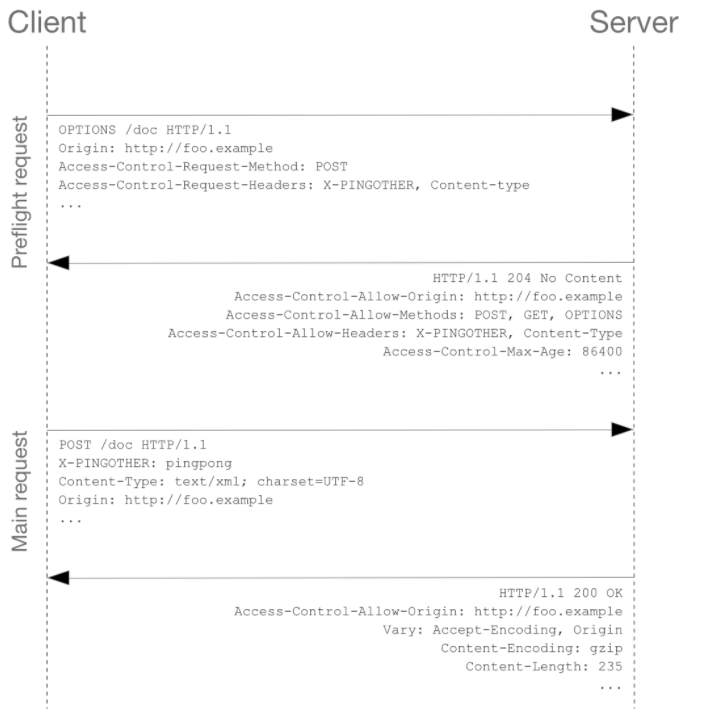

More info on: https://developer.mozilla.org/en-US/docs/Web/HTTP/CORS

### Requests with credentials

The most intersting capability of `fetch` and `CORS` is the ability to make **credentialed requests** that are aware of **HTTP Cookies** and **HTTP Authentication information**. By default, requests do not send credentials.

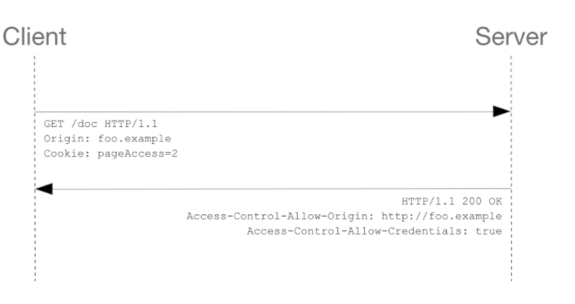

The browser would reject any response that does not have the `Access-Control-Allow-Credentials: true` header, and would not make the response available to the invoking web content.

## Session Cookies and Tokens

### HTTP Cookies

An **HTTP cookie** is a small piece of data that a server sends to the user's web browser. The browser may store it and send it back with later requests to the same server. Typically, it is used to tell if two request came from the same browser. It remembers stateful information for the stateless HTTP protocol.

Cookies are used for mainly three purposes:

**1. Session management:** Logins, shopping carts, or anything that a server should remember.
**1. Personalization:** User preferences, themes and other setting
**1. Tracking:** Recording and analyzing user behavior,

After receiving an HTTP request, a server can send one or mor `Set-Cookie` headers with the response. The cookie is usually stored by the browser, and then is is sent back in subsequent requests with the `Cookie` HTTP header. (an expiration date or duration for the cookie can be sent, after which it is considered expired.)

A simple cookie is set like this:

```
Set-Cookie: <cookieName>=<cookieValue>
```

A response from the server sending header to tell the client to store a pair of cookies:

```
HTTP/2.0 200 OK
Content-Type: text/html
Set-Cookie: userPreference1=blue
Set-Cookie: userBrands=burberry

[page content]
```

Then, on every subsequent request to the server, the browsers sends them back using the `Cookie` header:

```
GET /sample_page.html HTTP/2.0
Host: www.example.org
Cookie: userPreference1=blue; userBrands=burberry
```

### Tracking and Third-Party Cookies

A cooke is associated with a domain. If this domain is the same as the domain of the page the user is on, then that cooke is called a **first-party cookie**. If the domain is different, it is a **third-party cookie**.

While the server hosting a web page sets first-party cookies, the page may contain images or other components stored on servers in other domains (for example, ad banners) **which may set third-party cookies**. These are mainly used for advertisign and tracking across the web: a third party server can build up a profile of a user's browsing history and habits based on cookies sent to it by the same browser when accessing multiple sites.

### Cookie vs WebTokens for Authentication

This diagram is a great introduction and simplified overview of the difference between cookie and token approaches to authentication.

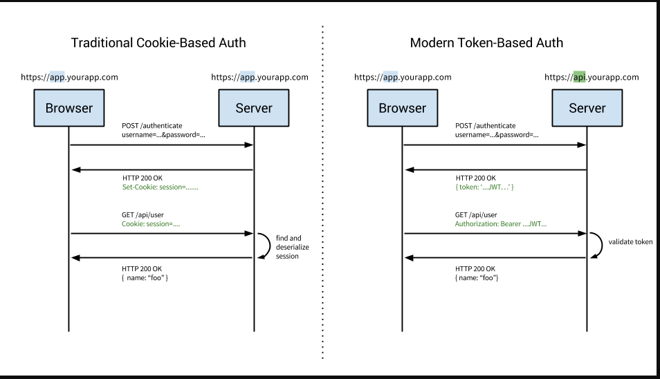

**Cookie-based Authentication** was the default, tried-and-true method for handlung user authentication. It is **stateful:** an authentication record or session must be kept both server and client-side. The server needs to keep track of active sessions in a database, while on the front-end, a cookie is created that holds a session identifier. Let's look at a flow of this:

1. User enters their login credentials.
2. Server verifies the credentials and creates a session, which is stored in a database.
3. A cookie with the session id is set in the user's browser by responding with the`Set-Cookie` header.
4. On subsequent requests, the session id is verified againt the database, and if valid, the request is processed and responsed.
5. If the user logs out of the app, the session is destroyed both client-side and server-side.

**Token-based Authentication** has gained prevalence over the last few years, especially due to the rise of SPAs and web APIs. We generally talk about authentication with **JSON Web Tokens (JWTs)**. Token-based authentication is **stateless**: the server does not keep a record of which users are logged in or which tokens have been issued. Instead, every requet to the server is accompanied by a token which the server uses to verift the authenticity of the request. It is sent usually in the `Authentication` header with `Bearer {JWT}` as value, but can also be sent in the body of a POST or as query param.

1. User enters their login credentials.
2. Server verifies the credentials are correct and returns a signed token.
3. This token is stored client-side, most commonly in local storage - but can be also stored in session storage or even in a cookie.
4. Subsequent requests to the server include this token in the `Authorization` header, or some other place.
5. Ther server decodes the JWT, and if the token is valid, it processes the request.
6. Once a user logs out, the token is destroyed client-side, no interaction with the server is necessary.

**Token-Based Advantages are:**

1. **Stateless, Scalable and Decoupled:** Authentication with tokens is **stateless**. The back-end does not need to keep a record of tokens. Tokens are self-contained, with all the data required to check its validity as well as to pass user information. The server's only job become to sign tokens on a successful login request and then verify that incoming tokens are valid.
2. **Cross Domain and CORS**: While cookies work well with domains and subdomains, they encoutner problems across domains. In contrast, a tokens-based approach with enabled CORS makes it tirivial to expose APIs to different services and domains: JWTs are required and check at all requests to the back-end, so as long as the token is valid, it can be processed.
3. **Store Data in the JWT**: While with cookies you simply store the session id, JWTs allow you to store any type of metadata, as long as it's valid JSON. So you can iclude data as the user id, expiration of the token or even more data such as who issued the token, scopes or permissions for the user, etc.
4. **Performance**: In the cookie-based approach, the back-end has to do a lookup to its database to look the session up, so the trip will be longer. Additionaly, with the JWTs containing more data, the server can save on lookups, for example, to know which scopes the user has. For example, say you had an API resource `/api/orders` that retrieves the latest orders placed via your app, but only users with the role of admin have access to view this data. In a cookie based approach, once the request is made, you'd have one call or lookup to the database to verify that the session is valid, another to get the user data and verify that the user has the role of admin, and finally a third call to get the data. On the other hand, with a JWT approach, you can store the user role in the JWT, so once the request is made and the JWT verified, you can make a single call to the database to retrieve the orders.
5. **Mobile Ready**: Native mobile platforms (such as Android and iOS) and cookies do not mix well: it is possible, but there are many limitations and considerations. Tokens are much easier to implement on both iOS and Android, as well as IoT applications and services, that do not have a concept of a cookie store.

**Token-Based Disadvantages are:**

1. **Size**: A session cookie is relatively tine compared even to the smallest of JWTs. Depending on the use case and claims added to it, its size can become problematic - it should be added to **all** requests to the server.
2. **Where to store them?**: While cookie-based approaches give you no option on where to store it, the implementer has the choice with JWTs. Commonly, it is stored in local storage, but this is sandboxed to a specific domain, excluding subdomains. It can also be stored in a cookie, but here the size of a cookie (4kB) may be problematic depending on the JWT token size.

### JWTs: How do they work?

https://jwt.io/introduction/

## HTTP messages

HTTP/1.1 messages and earlier are human readable. Since HTTP/2 these messages are embedded into a binary structure called a **frame**, but the semantics of each message is unchaged.

### HTTP Requests

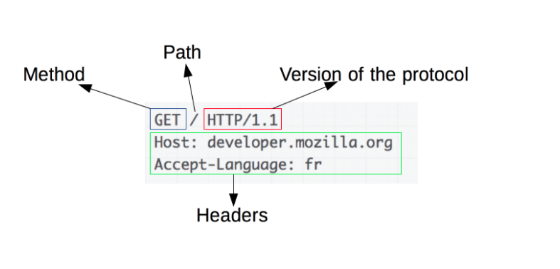

It consists of the following elements:

1. An **HTTP method**, that defines the operation that the client wants to perform.
2. The **path** to the resource: the URL of the resource stripped out from elements that are obvious from the context, like protocol, domain or TCP port.
3. The **version of the HTTP protocol**
4. Optional **request headers** fields
5. Optional **message body** for some methods

### HTTP Request Methods

HTTP defines a set of **request methods** to indicate a desired action to be performed on a given resource. Each of the methods implements a different semantic, but some common features are shared by a group of them: e.g. a request method can be *safe*, *idempotent* or *cacheable*. Method names are case-sensitive, in comparison with header field names.

* `GET`: Requests a representation of a given resource. Requests using this method should only retrieve data and should have no other effect.
* `HEAD`: Asks for a response identical to that of a GET request, but without the response body. Useful for retrieving meta-information written in the response header or in the response status code, without having to transport the entire content.
* `POST`: Used to submit an entity to the specified resource, often causing a change in state or side effects on the server, for example, adding an item to a database.
* `PUT`: Replaces all current representations of the target resource with the request payload. If the URI does not point to an existing resource, then the server can create the resource with that URI.
* `DELETE`: Used to delete a resource in the specified URI.
* `TRACE`: Echoes the recieved request back to the client so that it can see if any changes or additions ahve been made by intermediate servers or proxies.
* `OPTIONS`: Returns the HTTP methods that the server supports for a specified URL.
* `CONNECT`: Establishes a tunnel to the server identified by the target resource.
* `PATCH`: Applies partial modificiation to a resource.

### Idempotent request methods

An HTTP method is **idempotent** if an identical request can be made several times in a row with the same effect, while leaving the server in the same state. 

Implemented correctly, `GET`, `HEAD`, `PUT` and `DELETE` are idempotent.

To be idempotent, only the acutal back-end state of the server is considered, whilte the status code return by each request might differ: the first call of a `DELETE` will probably return `200`m while succesive ones will likely return `400`.

### Safe request methods

An HTTP method is **safe** if it doesn't alter the state of the server: a method is safe if it leads to a read-only operation. `GET`, `HEAD`, `OPTIONS` and `TRACE` are safe.

All safe methods are idempotent, but not the other way around: `PUT` and `DELETE` are idempotent but not safe.

### HTTP Response

An HTTP response method consists of:

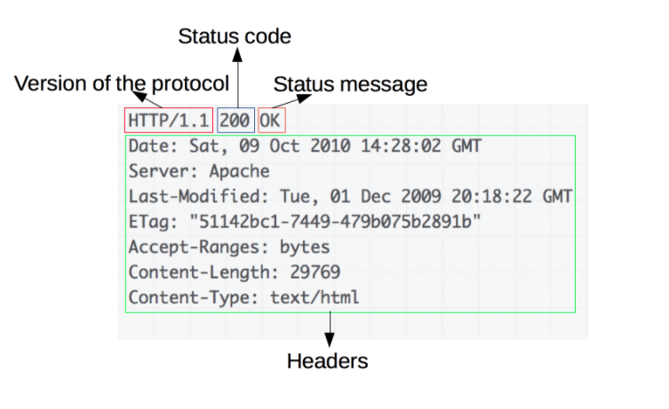

1. the version of the **HTTP protocol** followed
2. the **status code**, which indicates if the request was succesful or not, and why.
3. a **status message**, a short description of the status code.
4. **HTTP headers**, similar to request headers
5. An optional **body** containing the fetched resource

### HTTP Response Status Codes

HTTP response status codes indicate whether a specific HTTP request has been succesfully completed, or not, and why, and the responses are grouped in five classes:

1. **Informational responses:** from 100 to 199
2. **Succesful responses:** from 200 to 299
3. **Redirects:** from 300 to 309
4. **Client-side errors**: from 400 to 409
5. **Server-side errors:** from 500 to 599

## Cacheable HTTP responses

A **cacheable** response is an HTTP response that can be cached, that is: they are responses that are allowed to be stored for future reuse.

Not all HTTP methods can be cached: there are the following constraints:

1. The method used in the request is itself cacheable: it is either a **GET** or a **HEAD** (`POST` and `PATCH` can theoretically be cached, but they are almost never done in practice).
2. The status code also has to be cacheable: `200`, `203`, `204`, `206`, `300`, `301`, `404`, `406`, `501`.
3. The `Cache-Control` header can prevent cacheing.

# FTP (File Transfer Protocol)

The **File Transfer Protocol** is a standard Application Layer protocol used for the transfer of files between a client and a server on a computer network. It runs over the TCP Transport Protocol.

It is built on the client-server model architecture, and users may authenticate themselves using a clear-text sign-in protocol, normally in the form of a username and password - but can also connect anonymously if the server allows it. 

For secure transmission that protects the user and password, FTP is often secured with TLS/SSL or directly replaced by SSH File Transfer Protocol (SFTP).

FTP has **a stateful control connection** which maintains a current working directory and other flags, and each transfer requires a secondary connection through which the data is transferred.

Setting up an FTP control connection is quite slow due to the round-trip delays of sending all of the required commands and awaiting responses, so it is customary to set up a control connection and hold it open for multiple file transfers rather than drop and restablish a session afresh for each transfer. In contrast, HTTP originally dropped the conenction because doing so was cheap and quick.

FTP was not designed to be a secure protocol, and has many security weaknesses: it does not encrypt is traffic; all transmissions are in clear text and usernames, passwords, commands and data can by read by anyone able to perform a packet capture on the network.

Common solutions to this problems are:

1. Using the secure versions of the insecure protocol: FTPS instead of FTP, which applies TLS security on top of TLS.
2. Using a different, more secure protocol such as SFTP (SSH File Transfer Protocol), which is not FTP run over SSH.
3. Using directly SSH to set up a secure tunnel, or using a Virtual Private Network (VPN).

# SSH (Secure Shell)

**Secure Shell (SSH)** is a cryptographic Application Layer protocol for operating network services securely over an insecured network. Typical application include remote command-line, login and remote command execution.

SSH provides a **secure channel** (a way of transferring data that is resistant to both overhearing and tampering) over an unsecured network by using a client-server architecture, connecting an SSH client application with an SSH server.

It has assigned port 22 for TCP, UDP and SCTP.

SSH uses public-key cryptography to authenticate the remote computer and allow it to authenticate the user, if necessary.

SSH uses a manually generated public-private key pair to perform the authentication, allowing users or programs to log in without having to specify a password. In this scenario, the public key is placed on all computers that must allow access to the owner of the matching private key (the owner keeps the private key secret) - is is usually stored on an OS file. While authentication is based on the private key, the key itself is never transferred through the network during authentication. SSH only verifies whether the same person requesting access to the host with a certain public key also owns the matching private key. 

# Public-key cryptography

**Public-key cryptography** is a cryptographic system that uses pairs of keys: **public keys**, which may be disseminated widely, and **private keys**, which are known only to the owner. 

The generation of such keys depends on cryptographic algorithms based on mathematical problems to produce one-way functions. Effective security only requires keeping the private key private; the public key can be openly distributed without compromising security.

In such a system, any person can encrypt a message using the receiver's public key, but that encrypted message can only be decrypted with the receiver's private key.

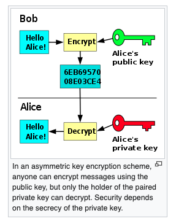

Robust authentication is also possible. A sender can combine a message with their own private key to create a short **digital signature** on the message. Anyone with the sender's corresponding public key can combine the same message and the supposed digital signature associated with it to verify whether the signature was valid, i.e. made by the owner of the corresponding private key.

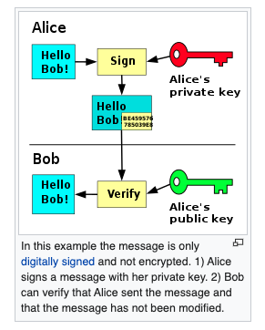

# SMTP (Simple Mail Transfer Protocol)

The **Simple Mail Transfer Protocol (SMTP)** is a communication protocol on the Application Layer for electronic mail transmission.

Mail servers and other message transfer agents use SMTP to send and receive mail messages. SMTP servers commobly use the TCP protocol on **port 25**.

User-level email clients such as Gmail typically use SMTP only for sending messages to a mail server for relaying. For retrieving messages, **IMAP** and **POP3** are standard, but propietary protocols also exist and are used by propietary servers.

SMTP is a **connection-oriented, text-based protocol** in which a mail sender communicates with a mail receiver by issuing command strings and supplying necessary data over a reliable ordered data strea channel typically a **Transmission Control Protocol (TCP)** connection.

Details on protocol: https://en.wikipedia.org/wiki/Simple_Mail_Transfer_Protocol

SMTP is a delivery protocol only. In normal use, mail is "pushed" to a destination mail server. Mail is routes based on the destination server, not the individual users(s) to which it is addressed. Other protocols such as as the **Post Office Protocol (POP#3)** and the **Internet Message Access Protocol (IMAP)** are specifically designed for use by individual users retrieving messages and managing mail boxes.

# Client-Server models

The **client-server model** is a **distributed application** structure that partitions tasks or workloads between the providers of a resource or service, called **servers**, and resource or service requesters, called **clients**.

Often clients and servers communicate over a computer network on separate hardware, but both client and server may reside in the same system.

A server host runs one or mor server programs, which share their resources with clients. A client does not share its resources, but it requests content or service from a server.

Clients therefore initiate communication sessions with server, which await incoming requests.

Examples of computer applications taht user the client-server model are the World Wide Web, email and network printing.

Clients and servers exchanges messages in a request-response messaging pattern. The client sends a request, and the server returns a response. To communicate, the computers must have a common language, and they must follow rules so that both the client and the server know what to expect: the language and rules of communication are defined in a communications protocol. 

All client-server protocols operate in the **Application Layer**, which defines the basic patterns of the dialogue. To formalize the data exchange even further, the server may implement an **API (Application Programming Interface)**, an abstraction layer for accesing a service, which retricts communication to a specific format.

A server may receive requests from many distinct clients in a short period of time. A computer can only perform a limited number of tasks at any moment, so it relies on a scheduling sustem to prioritize incoming requests from clients to accomodate them. To prevent abuse and maximize availability, the server software may limit the availability to clients. Denial of service attacks are designed to exploit a server's obligation to process requests by overloading it with excessive requests rates.

## Comparison to peer-to-peer architecture

In addition to the client-server model, another **distributed application** structure is the **peer-to-peer (P2P)** application architecture.

In the client-server model, the server is often designed to operate as a centralized sustem that serves many clientes. The computing power, memory and storage requirements of a server must be scaled appropriately to the expected workload of the clients. Load-balancing and failover systems are often employed to scale the server beyond a single physical machine.

In a peer-to-peer network, two or more computers (peers) pool their resources and communicate in a **decentralized system**. Peers are equipotent and coequal nodes in a **non-hierarchical network**, and unlike clients in the client-server model, the peers communicate directly with each other.

In peer-to-peer networking, an **algorithm** in the peer-to-peer communications protocol balances load, and even peers with modest resources can help to share the load. If a node becomes unavailable, its shared resources remain available as lons as other peers offer it. 

Ideally, a peer does not need to achieve high availability because other, redundant peers make up for any resource downtime; as the availability and load capacity of peers change, the protocol reroutes requests.

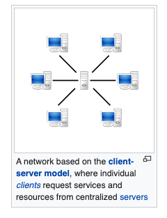
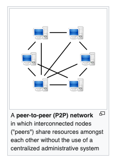

# REST (Representational State Transfer)

**Representational State Transfer (REST)** is a software architectural style that defines a set of constraints to be used for creating Web services.

Web services that conform to this style are called RESTful Web services and provide interoperability between computer systems on the internet. RESTful services allow the requesting systems to access and manipulate representations of Web resources by using a **uniform and predefined set of stateless operations**.

In a RESTful Web service, requests made to a resource URI will elicit a response with a payload formatted in HTML, XML, JSON or some other format. The response can confirm that some alteration has been made to the resource state, and the response can also provide hypertext links to other related resources.

By using a stateless protocol and standar operations, RESTful systems aim for fast performance, reliability and the ability to grow by reusing components that can be managed and updated without affecting the system as a whole, even while it is running.

## REST Architectural Constraints

Six guiding constraints define a RESTful system, and they restric the ways that the server can process and respond to client requests. By operating within these constraints, the system gains desirable non-functional properties, such as performance, scalability, simplicity, modifiability, visibility, portability and reliability.

* **Client-server architecture**: the priciple behind the client-server constraint is the **separation of concerns**. Separating the user interface concerns from the data storage concerns improves the ***portability*** of the user interfaces across multiple platforms. It also improves ***scalability*** by simplyfing the server components.
* **Statelessness**: The client-server communication is constrained by no client context being stored on the server between requests. Each request from any client contains all the information necessary to service the request, and the session state is held in the client. The session state can be transferred by the server to another service such as a databe to maintain a persistent state for a period, and allow features such as authentication or personalization.
* **Cacheability**: Clients and intermediaries can cache responses. Responses must, either implicitly or explicitly, define themselves as cacheable or non-cacheable to prevent stale or inappropiate dataa in response to further requests. Well-manage caching can completely eliminate some client-server interaction, improving **scalability** and **performance**.
* **Layered system**: A client should not ordinarily tell whether is is connected directly to the end server, or to an intermediary along the way. If a proxy or load balancer is placed between the client and server, it won't affect their communications and there won't be a need to update the client or server code. These intermediary servers can improve **scalability** by enabling load balancing and by providing shared caches.
*  **Uniform interface**: it simplifies and decouples the architecture, enabling each part to evolve independently. It has four constraints:
   *  **Resource identification in requests**: Individual resoures are identified in requests, for example, using URIs. The resources themselves are conceptually separate from the representations that are returned to the client. For example, the server could send data from its database as HTML, XML or as JSON - none of whcih are the erver's internal representation.
   *  **Resource manipulation through representations**: When a client holds a representation of a resource, including any metadata attached, it has enough information to modift or delete the resource's state.
   *  **Self-descriptive messages**: Each message includes enough information to describe how to process the message. For example, which parse to invoke can be specified by the media type.

# What happens when?

https://medium.com/@maneesha.wijesinghe1/what-happens-when-you-type-an-url-in-the-browser-and-press-enter-bb0aa2449c1a

https://www.freecodecamp.org/news/what-happens-when-you-hit-url-in-your-browser/

https://github.com/alex/what-happens-when

https://afteracademy.com/blog/what-happens-when-you-type-a-url-in-the-web-browser

