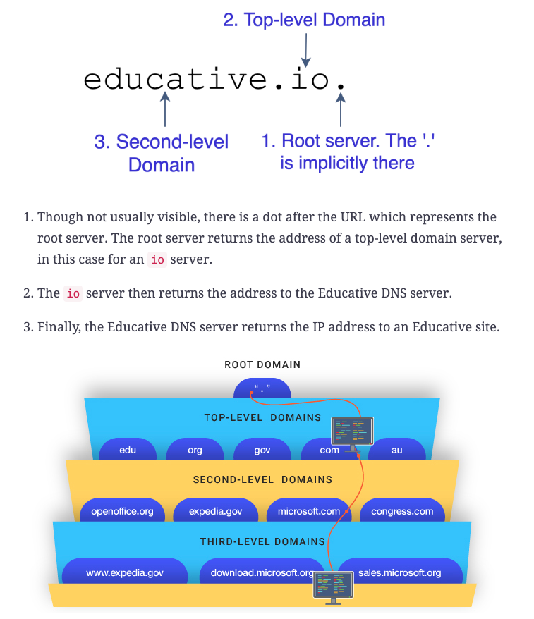

# TCP/IP

**TCP/IP**, which stands for **Transmission Control Protocol/Internet Protocol** is a group of guidelines according to which network devices are connected via the internet. This protocol determines the means by which data is transferred over the internet.

## What do TCP and IP do?

**TCP** provides **reliable, ordered and error-checked** delivery of a stream of bytes between applications running on hosts communicating via an IP network.

TCP handles all handshaking and transmission details and presents an abstraction of the network connection to the applications running on the hosts.

Because of factors such as network congestion, traffic load balancing or unpredicatable network behaviour, packets may be lost, duplicated or delivered out of order. TCP detects these problems, requests re-transmission of lost data, re-arranges out-of-order data or deletes duplicate data. Once the TCP receiver has reassembled the sequence of bytes originally transmitted, it passes them to the receiving application. (So this networking details are abstracted by the TCP from the application communication).

TCP is a reliable stream delivery service which guarantees that all bytes recieved will be identical and in the same order as those sent. Since packet transfer by many networks is not reliable, TCp achieves this using a technique known as *positive acknowledgement with re-transmission*. This requires the receiver to respond with an acknowledgement message as it receives the data. The sender keeps a **record** of each packet it sends and mantains a **timer** from the moment when the package was sent. The sender re-transmits a packet if the timer expires before receiving the acknowledgement, which could mean that the packet got lost or corrupted.

Major internet applications such as the World Wide Web (WWW), email (SMTP), P2P file sharing, Secure Shell (SSH) and file transfer (FTP) rely on TCP, which is part of the Transport Layer of the TCP/IP suite.

**IP (Internet Protocol)** has the task of delivering packets from the source host to the destination host solely based on the IP addresses in the packet headers. For this purpose, IP defines packet structures that encapsulate the data to be delivered, which contain a header and a payload. IP determines the route that the packet takes to reach its destination: it sets the route for the packet transfer.

## How do TCP and IP layers work together?

While **IP** handles actual delivery of the data, **TCP** keeps tracks of segments - the individual units of data that a message is divided into for efficient routing thought the network. 

For example, when an HTML file is sent from a web server, the TCP layer divides the file into segments and forwards them individually to the **internet layer** on the **network stack**, where the **IP** protocol encapsulates each of them into an IP packet by adding a header which contains (among other data) the destination IP address, while the payload is the actual data to be transmitted.

When the client program on the destination host receives them, the TCP software in the transport layer re-assembles the segments and ensures they are correctly order and error-free. Then it streams the file contents to the receiving application. 

## Network Stack Layers

The Request For Comments (RFC) 1122 loosely defined a four-layer model, with the layer having names:

There are four layers that comprise **Network Stack**:

1. The **Application Layer** is the scope in which applications, or processes, create user data and communicate this data to other applications on another or the same host. The applications make use of the services provided by the underlying lower layer, especially the (next) transport layer, which provides with either reliable or unreliable pipes to other processes. This is the layer in which all application protocols, such as **HTTP, SMTP, FTP and SSH** operate. Processes are addressed via ports which essentially represent services.
2. The **Transport Layer** performs host-to-host communications on either the local network or remote networks separated by routers. It provides a channel for the communication needs of applications. Here, connectivity can be categorized as either **connection-oriented, implemented in TCP**, or as **connectionless, implemented in UDP**. This layer is for example where TCP addresses reliability issues during the transfer like packets arriving in the wrong order, or corrputed, or being list.
3. The **Internet Layer** provides internetworking between independent networks, by hiding the actual topology of the underlying network connections. It is therefore the layer that defines and establishes the Internet. This layer defines the addressing and routing structures used in the **IP protocol**, which defines IP addresses. Its function is to transport packets to the next host, functioning as an IP router, that has the connectivity to a network closer to the final destination of the data.
4. The **Link Layer** contains the communication methods for data that remains within a single network segment. It includes the protocols used to describe the local network topology.

Example of encapsulation of application data carried by UDP to a link protocol frame.

## TCP Protocol Operation

**TCP protocol operation** is divided into thre phases: connections must be properly established in a multi-step handshake process during the ***connection establishment*** phase, before entering the actual ***data transfer*** phase.

After data transfer is completed, the ***connection termination*** closes established virtual circuits and releases all allocated resources.

### *Connection establishment: TCP and the Three-Way Handshake*

**TCP** sets up connections via a three-way handshake, which is also called **SYN-SYN-ACK**. It is named so because three messages are required to start the connection between two network devices. 

Before a client attempts to connect with a server, the server must first bind to and listen at a port to open it up for connections: this is called a **passive open**. 

Once the the passive open is established, a client may initiate an **active open**.

To establish a connection, the three-way handshake occurs:

1. **SYN:** The first host, or client, performs an active open by sending a **SYN** packet to the server. The client sets the segement's sequence number to a random value X.
2. **SYN-ACK:** In response, the server replies with **SYN-ACK**, with the acknowledgement number and an additional sequence number. The acknowledgement number is set to one more than the recieved number, i.e. X+1, while the server's sequence number is set to a random number Y.
3. **ACK:** Finally, the clients sends an **ACK** back to the server. The sequence number is set to the received acknowledgement number (X+1) from the server and the acknowledgement number is set to recieved sequence number from the server, plus 1, i.e.: Y+1.

At this point, both the client and server have received an acknowledgement of the connection. The steps 1 and 2 establish the connection parameter (or sequence number) in onde direction and it is acknowledged. The steps 2 and 3 establish the connection parameter for the other direction and it is acknowledged. With these, a full-duplex communication is established.

### *Connection termination*

The connection termination phase uses a four-way handshake, with each side of the connection terminating independently.

When an endpoint wishes to stop its half of the connection, it transmits a **FIN** packet, which the other end acks with an **ACK** packet.

Therefore a typical connection termination requires a pair of **FIN** and **ACK** segments from each TCP endpoint, i.e. four packets delivered:

After the side that sent the first **FIN** has responded with the final **ACK**, it waits for a timeout before finally closing the connection, during which time the local port is unavailable for new connections: this prevents confusion due to delayed packets being delivered in subsequent connections.

## IP Protocol: IPv4 vs IPv6

An IP address is a string of numbers that is assigned to a device to identify it on the internet. It is an address, just as the number and street of a home address, where packets can be sent to. That is exactly what the IP does: send packets to IP addresses.

There are two versions of Internet Protocol addresses: IPv4 and the newer IPv6.

### IPv4

Internet Protocol version 4 was developed in the early 1980s.

An **IPv4** comprises four number, each ranging from 0 to 256, separated by periods, a 32-bit address. Because of this, IPv4 has a theoretical limit of 4.3 billion addresses, which was more than enough. But with today's era of smartphones and IoT devices, we have went close to running out of addresses.

While initially workarounds have been implemented to postpone the issue, a successor was quickly needed and IPv6 was developed. At present, IPv4 and IPv6 coexist on the internet, but eventually as IPv4 equipment gets phased out, everything will be IPv6. It is just being rolled out slowly as replacing old IPv4 equipment would be prohibitively expensive and disruptive.

### IPv6

Internet Protocol version 6, or **IPv6** was introduced in the late 1990s as a replacement for IPv4.

**IPv6** uses 128-bit addresses, allowing for a theoretical 340 undecillion addresses. They are represented by eight groups of four hexadecimal digits, with the group separated by colons, although they are often abreviated.

In addition of solving the supply IP addresses, IPv6 also addressed many of version 4 shortcomings.

### IPv4 vs IPv6

IPv6 brought more functionality, in addition to more IP addresses.

* **More Efficient Routing:** IPv6 reduces the size of routing tables and makes routing more efficient and hierarchical. It allows ISPs to aggregate the prefixes of their customer's networks into a single prefix and announce this one prefix to the IPv6 internet.
* **More Efficient Packet Processing**: IPv6's simpliefied packet header makes packet processing more efficient. Compated to IPv4, IPv6 contains no IP-level checksum, so the checksum does not need to be recalculated at every router hop. Getting rid of the IP-level checksum was possible because most Link Layer technologies already contain checksum and error-control capabilities. In addition, most Transport Layers, which handle end-to-end connectivity, have a checksum that enables error detection.
* **Directed Data Flows:** IPv6 supports **multicast addressing**, rather than broadcast. This allows bandwith-intensive packet flows (such as multimedia streams) to be sent to multiple destinations simultaneously, saving network bandwidth. Desinterested hosts no longer must process broadcast packets.
* **Simplified Network Configuration**: IPv6 has a new feature called **autoconfiguration**, which allows a device to generate an IPv6 address as soon as it powers up and puts itself on the network. Adress auto-configuration (addess asignment) is built into IPv6. A router will send the prefix of the local link in its router advertisements. A host can generate its own IP address by appending its Link-Layer (MAC) address converted into Extended Universal Identifier (EUI) 64-bit format, to the 64 bits of the local link prefix.
* **Support For New Services:** By eliminating Network Address Translation (NAT), true end-to-end connectivity at the IP layer is restored, enabling new and valuable service. Peer-to-peer networks are easier to create and maintain, and services such as VoIP and Quality of Service (QoS) become more robust.
* **Security:** IPSec, which provides confidentiality, authentication and data integrity, is baked into IPv6. 

## Domain Name System (DNS)

**Domain Name System (DNS)** is a decentralized naming system for resources connected to the Internet or a private network, that associates various information with domain names. More prominently, it translates "easy to remember" domain name to the numerical IP addresses needed for locating and identifying computer services and devices across the Internet.

The most common types of records stored in the DNS database are:
* **IP addresses (A -IPv4- and AAAA -IPv6-)**
* Domain name aliases **(CNAME)**: A **Canonical Name Record** is a type of resource that maps one domain name (an alias) to another (the canonical name). This can prove convenient when running multiple services (such as an FTP server and a web server, each running on different ports) from a single IP address. One can, for example, point *ftp.example.com* and *www.example.com* to the DNS entry for *example.com*, which in turn has an *A record* which point to the IP address. Then if that IP address ever changes, one only has to change the A record. **CNAME** record must always point to another domain name, never directly to an IP address.
* **Start of Authority (SOA) record**: contains administrative information about the zone, especially regarding zone transfers. Normally DNS name servers are set up in clusters. The database within each cluster is synchronized through zone transfers. The SOA record for a zone contains data to control the zone transfer. This is the serial number and different timespans. It also contains the email address of the responsible person for this zone, as well as the name of the primary master name server.
* **SMTP mail exchangers (MX)**: Maps a domain name to a list of *Message Transfer Agents* for that domain. **MTAs** is software that transfers email messages from one comouter to another using **SMTP**.
* Pointers for **reverse DNS lookups (rDNS)**: it is the querying technique of the DNS to determine the domain name associated with an IP address - the reverse of the usual "forward" lookup of an IP address from a domain name.

### Server Hierarchy

DNS records are part of a distributed database. This means all records are not stored at any one server but they are distributed among several global servers.

DBS servers are divided into zones that form a **hierarchy**.

The servers are the top are called **root servers** and they store IP addresses of other DNS servers, called **top level domain servers (TLD)**.

**TLDs** are divided by site-type, i.e. `.com` or `.edu` and they have mappings to **second-level domain servers**, such as a server for `wikipedia.com`. These are the DNS servers that contain mappings to the actual server that host the domain in question.

A full **DNS resolution**, if the record cannot be found locally, is conducted as follows:

1. The first point of contact for a full resolution is a **root server**. There are now over a thousand root servers (thanks to anycast), although originally there were only 13.
2. The **root server** returns the **IP address** of the relevant **top-level domain server**.
3. The **top-level domain server** contains the **DNS record** of the server we are looking fore. The **second-level domain server** returns the IP address to the browser.

Falta sobre el cache, y la parte de que pasa cdo escribis la url en chrome

## Main Application Protocols

HTTP (encryption via HTTPS!?), SMTP, FTP, SSH, etc

## Transfer Protocols (ponerlo arriba de DNS)

TCP already explained
UDP -> focus on this.

## What happens when?

https://medium.com/@maneesha.wijesinghe1/what-happens-when-you-type-an-url-in-the-browser-and-press-enter-bb0aa2449c1a

https://www.freecodecamp.org/news/what-happens-when-you-hit-url-in-your-browser/

https://github.com/alex/what-happens-when

https://afteracademy.com/blog/what-happens-when-you-type-a-url-in-the-web-browser